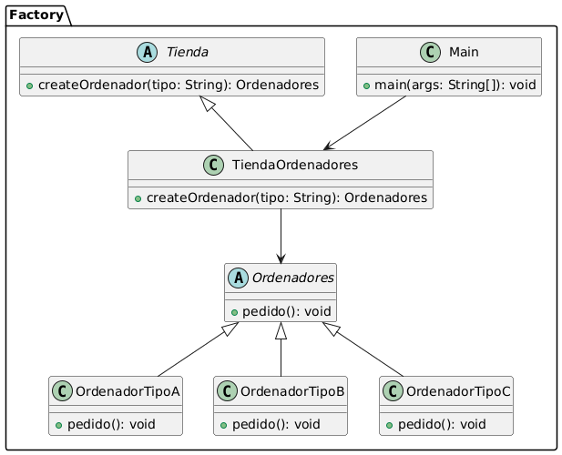
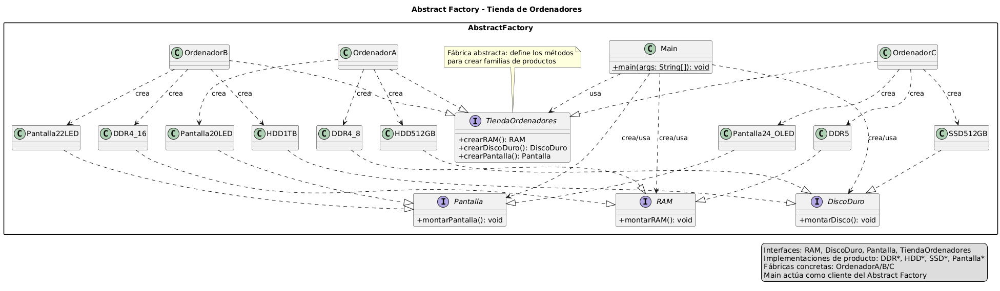

# Factory & Abstract Factory

Grupo formado por: Matthew Puente-Villegas Michavila, Luis Holgado Arranz

## Explicación src

Dentro de la carpeta src encuentras dos paquetes, uno Factory, donde esta hecho el codigo implementando el patrón factory, y otro Abstract Factory, donde está hecho el código implementando el patrón abstract factory

## Diagramas UML

### Factory

### Abstract Factory

