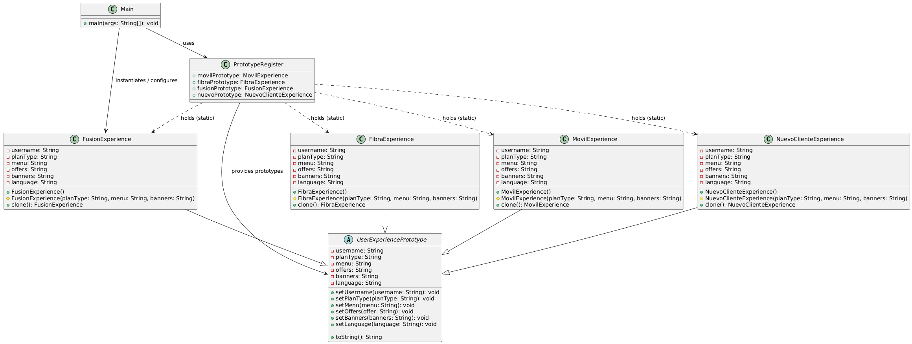

# 🧩 Patrón Prototype - User Experience Simulator

Proyecto creado por Matthew Puente-Villegas Michavila y Luis Holgado Arranz.

Este proyecto es una implementación del **Patrón de Diseño Prototype** en Java.
Se simulan experiencias de usuario (planes de servicio como fibra, móvil, fusión o nuevo cliente) que pueden crearse desde cero o clonarse a partir de un **registro de prototipos**.

---

## 📌 Objetivo del Proyecto

* Mostrar cómo el **patrón Prototype** permite **duplicar objetos complejos** sin necesidad de reconstruirlos desde cero.
* Comparar tiempos de ejecución entre:

  * Crear una experiencia manualmente.
  * Crear una experiencia mediante **clonación**.

---

## 🏗️ Estructura de Clases

* **`UserExperiencePrototype`**
  Clase abstracta base que define los atributos y métodos comunes.
  Implementa `Cloneable`.

* **Experiencias concretas (subclases):**

  * `FibraExperience`
  * `FusionExperience`
  * `MovilExperience`
  * `NuevoClienteExperience`

  Cada una redefine el método `clone()`.

* **`PrototypeRegister`**
  Almacena prototipos estáticos listos para clonar.

* **`Main`**
  Simula la creación manual de experiencias y la clonación de prototipos, midiendo el tiempo de ejecución.

---

## 📜 Diagrama UML

A continuación, un diagrama UML generado con **PlantUML** para visualizar la arquitectura:



---

## ⚙️ Ejemplo de Ejecución

⭐

```
Cargando experiencia fusión de 0.
Usuario Juan Perez, con idioma es y plan Fusion Experience, con oferta +10 GB gratis en Fusion Menu con Fusion Banners.
Tiempo de ejecución: 2000123456 ns, en milisegundos: 2000 ms

Creando experiencia de fibra mediante clonación.
Usuario Fernando Alonso, con idioma es y plan Fibra Experience, con oferta +5 GB gratis en Fibra Menu con Fibra Banners.
Tiempo de ejecución: 7139400 ns, en milisegundos: 7 ms
```

⭐

Como se observa, la clonación es **mucho más rápida** que la construcción manual.

---

## 📖 Patrón Prototype

Este patrón se utiliza cuando:

* La creación de un objeto es **costosa en tiempo o recursos**.
* Se requiere **duplicar configuraciones** existentes de manera eficiente.
* Se busca flexibilidad para crear variantes de objetos sin acoplarse al constructor.

---

## 📄 Licencia

Este proyecto está bajo la **licencia Apache 2.0**.
Puedes usarlo libremente, siempre respetando las condiciones de dicha licencia.